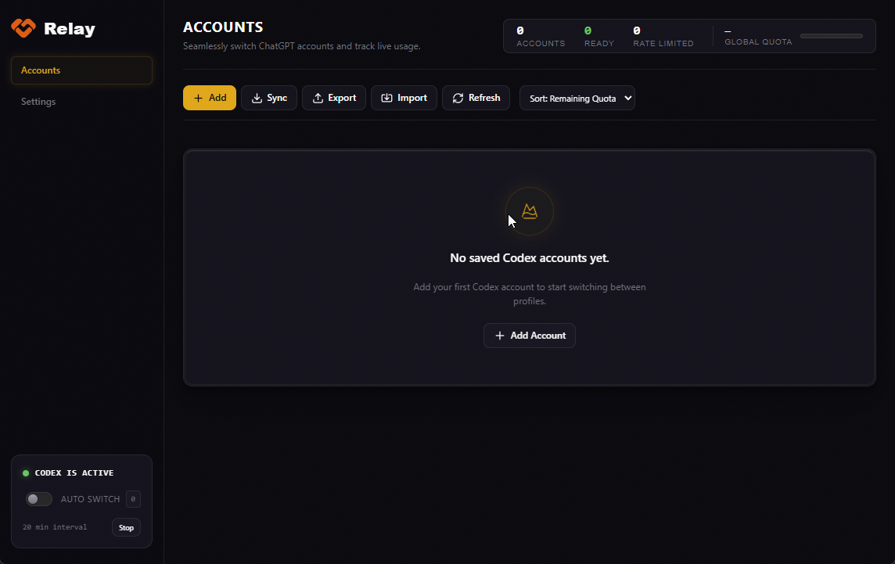

<div align="center">
  

  # Relay

  **Account manager for ChatGPT Desktop**  
  *Switches accounts in `~/.codex` with encrypted profiles and automatic failover*

  [](https://github.com/ark-daemon/relay/releases)
  [](https://github.com/ark-daemon/relay/actions)
  [](https://electronjs.org)
  [](https://www.typescriptlang.org)
  [](./LICENSE)

  [Download](#installation) • [Features](#features) • [How it works](#how-it-works) • [Security](#security) • [Development](#development)

  <br/>
  <br/>

  
</div>

---

Relay is a desktop application for Windows, macOS, and Linux.
It helps you hold multiple ChatGPT and Codex accounts.
You can switch between accounts in two seconds.
You do not edit configuration files manually.

The application encrypts stored credentials on your computer.
It saves each account state in `~/.codex`.
It switches the active profile and restarts the desktop application cleanly.

> [!NOTE]
> There is no telemetry and no analytics.
> Credentials stay on your computer.
> The application connects only to the OpenAI endpoints `auth.openai.com` and `chatgpt.com`.

## Requirements

- Install the desktop application for OpenAI Codex. On Windows, the package name is `OpenAI.Codex`. The process name is `ChatGPT.exe` or `Codex.exe`.
- Node.js 22 or later (necessary only if you build from source code).

This application manages Codex agent sessions and quotas.
It does not manage chat history on the ChatGPT web site.

## Installation

Download the installer for your platform from the [Releases page](https://github.com/ark-daemon/relay/releases):

| Platform | Package |
|---|---|
| **Windows** | `Relay-Setup-x.x.x.exe` (NSIS installer) or `Relay x.x.x.exe` (portable) |
| **macOS** | `Relay-x.x.x.dmg` |
| **Linux** | `relay_x.x.x.deb` or `relay-x.x.x.tar.gz` |

The application searches for updates when it starts.
You can also search for updates on the Settings page.
The application does not install updates silently in the background.

> [!IMPORTANT]
> **Linux:** Encrypted authentication storage requires the package `libsecret-1`.
> On Debian and Ubuntu, run `sudo apt install libsecret-1-0`.
> If no system keyring is available, enter a session passphrase (AES-256-GCM) when the prompt appears.

## Features

- **Fast account switch:** Decrypts the target profile, writes files into `~/.codex`, closes the desktop application, and starts it again.
- **Quota status monitor:** Refreshes the quota of each account at regular intervals (default is 20 minutes). Shows five-hour, weekly, monthly, and credit limits.
- **Automatic failover switch:** When active quota drops below a threshold (default 10%), Relay selects the ready account with the highest quota.
- **Automatic token refresh:** Refreshes an expired access token before a switch if a refresh token is available.
- **Login capture:** Opens the web browser login page, captures authentication files, and saves a new profile.
- **Import and export:** Back up all profiles to an encrypted JSON file with a passphrase.
- **Single-instance lock:** Focuses the active window if you open Relay again. Prevents duplicate tray icons.
- **System tray integration:** Switch accounts and monitor quotas from the system tray. The application minimizes to the tray when you close the window.
- **System notifications:** Shows alerts for low quotas and restored access on Windows and macOS.
- **Color theme:** Follows the OS theme or your selection in Settings.

## How it works

Relay stores profiles in the application data directory.
When you switch an account, Relay does these steps:

1. Closes the desktop application processes (`ChatGPT.exe` or `Codex`).
2. Saves the managed files of the active account in its profile folder.
3. Copies the authentication, configuration, and state files of the target profile into `~/.codex`.
4. Starts the desktop application again.

### Account data and shared data

| Swapped per profile | Shared on the computer |
|---|---|
| `auth.json`, `profiles/`, `profiles.json`, `cap_sid` | Conversation databases (`state_5.sqlite*`) |
| `config.toml`, hooks, rules, agents, memories | `sessions/` folder and session index |
| Profile UI state (`.codex-global-state.json`)* | Cache, installation ID, model list |

\* Relay merges global state fields such as local projects, workspaces, and active plugins across accounts.

Relay does not separate conversation history for each account.
Codex stores all threads in shared database files.
If Relay replaced these database files, it can cause damage to thread history.

## Security

Threat model: A local attacker with file system access, or a compromised renderer process.

- **Encryption at rest:** Authentication files use Electron `safeStorage` (Windows DPAPI, macOS Keychain, or Linux libsecret). Files have the `CMENC1:` prefix.
- **Passphrase fallback:** If no OS keychain is available, Relay encrypts authentication files with AES-256-GCM (`CMPWD1:`). You enter a session passphrase at startup.
- **Fail-safe default:** If no keychain or passphrase is available, Relay does not write credentials in plain text.
- **Hardened renderer:** The renderer uses `contextIsolation` and `sandbox`. It does not expose Node.js APIs. IPC accepts messages only from trusted application frames.
- **Restricted network access:** Relay connects only to `auth.openai.com` (token refresh) and `chatgpt.com` (quota status).

> [!CAUTION]
> Protect your export files and passphrases.
> Export files contain account tokens.
> Always use a strong passphrase to encrypt export files.

If you find a security vulnerability, do not open a public issue.
Send an email with details and reproduction steps to `arkucrypto@gmail.com`.

## Compatibility

OpenAI can change binary names and package structures.
Relay supports these names:

- Process names: `ChatGPT`, `Codex`, `codex`
- MSIX package names: `OpenAI.Codex` and `OpenAI.ChatGPT`
- Session directory: `~/.codex`

If an update changes process names or paths, account switch operations can stop.
Open an issue on GitHub with your OS name, application version, and the active process list.

## Development

Prerequisites: Node.js 22 or later, and npm 10 or later.

```bash
git clone https://github.com/ark-daemon/relay.git
cd relay
npm install

# Run test suite
npm test

# Build files and start the application
npm start

# Package installer files
npm run dist        # Windows: NSIS installer and portable file
npm run dist:mac    # macOS: DMG file
npm run dist:linux  # Linux: DEB and TAR.GZ files
```

Continuous integration builds installers on each git push.
When you push a version tag (`v*`), the release workflow creates a GitHub Release.

### Project structure

```
electron/           # Main process
├── main.ts         # Window, tray, IPC, auto-update
├── preload.cts     # Typed context bridge
└── services/       # Profiles, auth, switch, usage, process, paths
src/                # React user interface
tests/              # Unit and integration tests
scripts/            # Build scripts and asset helpers
```

### Data directories

| Platform | Directory path |
|---|---|
| Windows | `%LOCALAPPDATA%\Relay\` |
| macOS | `~/Library/Application Support/Relay/` |
| Linux | `~/.config/Relay/` |

Active Codex session files stay in `~/.codex`.
Relay manages these files during an account switch.
This directory is different from the Relay data directory.
